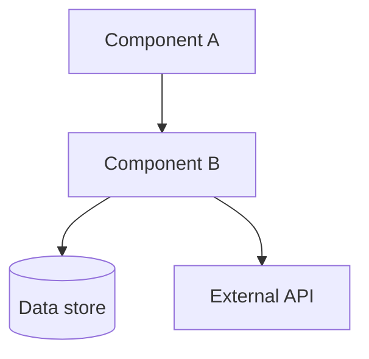
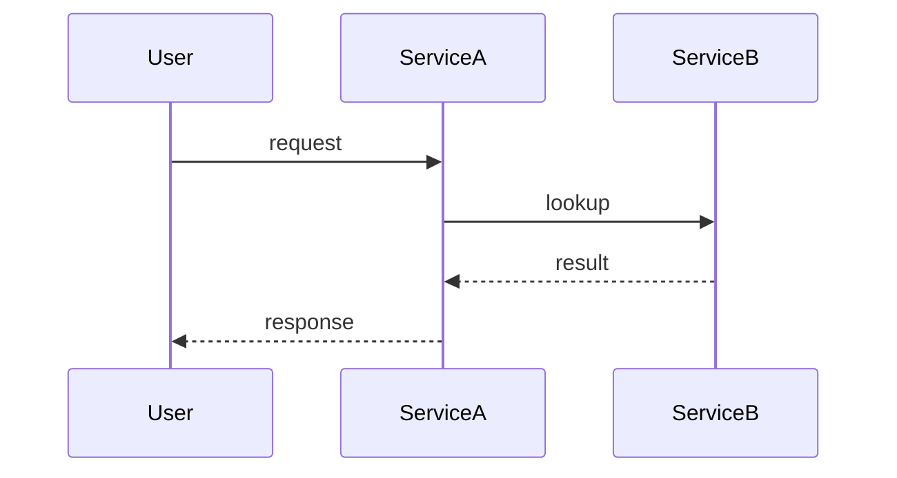
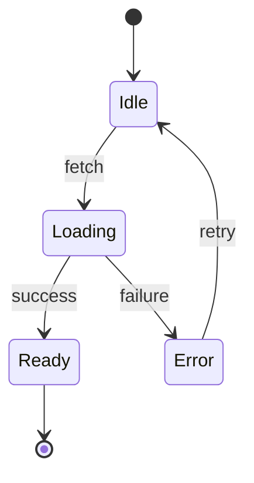

# <Title — what this explains>

## TL;DR

<2–3 sentences in plain language. Someone skimming should learn the gist here and decide whether to keep reading.>

## Audience note

<One line. Who this is pitched at, so a future reader knows the level. e.g. "Pitched at a dev new to this codebase — defines jargon, glosses internals.">

## High-level overview

<1–2 paragraphs of prose. What problem does this code solve? Where does it sit in the broader system? What are the major moving parts at a glance?>

## Architecture

<Brief explanation of the diagram. Name each box and edge. Anchor each component to a real file path (absolute) so the reader can jump in.>

## Key components

| File path | Role | Notes |
|---|---|---|
| `<absolute path>` | <what it does> | <gotcha, version, owner> |
| `<absolute path>` | <what it does> | <gotcha, version, owner> |

## How it works / data flow

Step-by-step:

1. <Step grounded in actual file/function. e.g. "`handleRequest` in `src/api/handler.ts:42` validates the payload">
2. <Next step>
3. <Next step>

## State machine

<Omit this section entirely if there isn't a real state machine. Otherwise:>

<Explain transitions and what triggers each.>

## Surprising bits / gotchas

<The non-obvious behaviors, footguns, "wait what?" moments. This is often the highest-value section. Examples:>

- **<Surprise 1>** — <what's surprising and why; cite the file/line>
- **<Surprise 2>** — <…>

## Where to look next

- **Callers / consumers**: <files that import or call into this area>
- **Downstream effects**: <what this triggers — events, jobs, side effects>
- **Related explanations**: <links to other .md files if any>

## Hot spots if you're modifying this

<Omit this section unless `audience: modifying`. Otherwise:>

- **<File / function>** — <why it's a hot spot: high blast radius, fragile contract, untested branch>
- **<Test to update>** — <which tests will need changes>
- **<Migration concern>** — <data, schema, or API consumers affected>

## Glossary

<Omit if no domain-specific terms. Otherwise define them here so the body stays clean.>

- **<Term>** — <definition>
